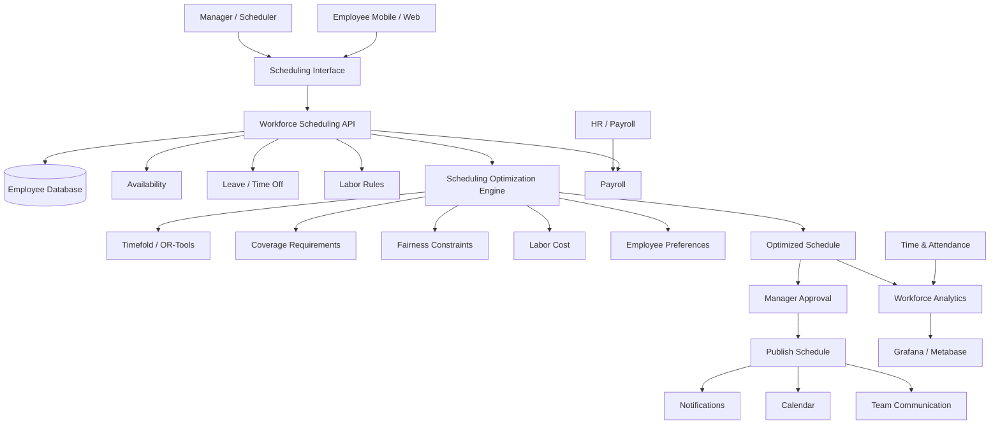
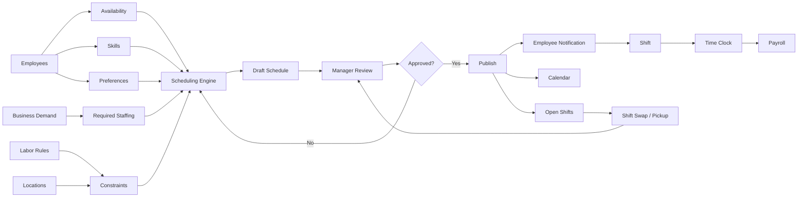
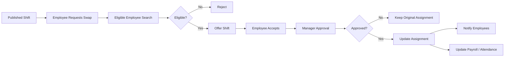
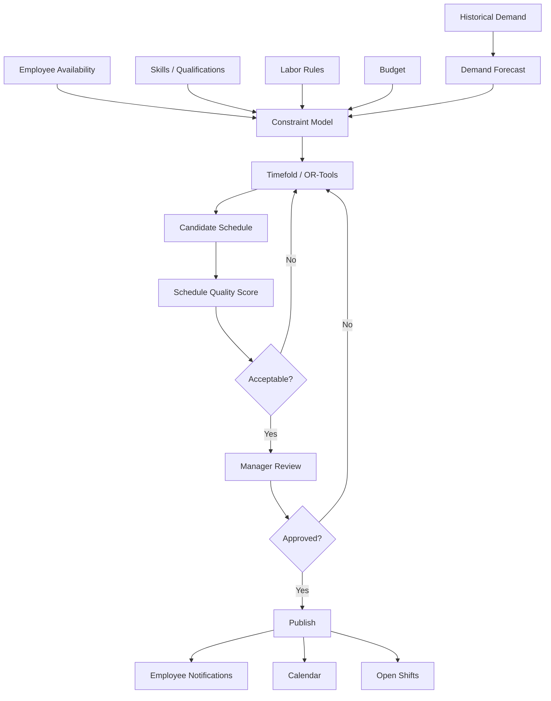

# Awesome-Shift-Scheduling-Platform

## Top Shift Scheduling Platform Ecosystem


**Curated List of SaaS/Hosted Platforms & Open-Source GitHub Projects**

*Focused on Employee Shift Scheduling, Workforce Management, Rostering, Time & Attendance, Shift Swapping, Availability, Labor Optimization, Team Communication & Workforce Automation*

**Last updated: September 2026**


This repository tracks notable **SaaS/Hosted platforms** and **open-source projects** for **employee shift scheduling and workforce management**. These systems help organizations create and publish schedules, match employees to shifts, manage availability, handle time-off requests, enable shift swaps, control overtime, track attendance, manage multiple locations, forecast labor requirements and integrate scheduling with payroll and HR systems.


**Examples** include Deputy, Planday, When I Work, Connecteam, Humanity, Homebase, Quinyx, 7shifts, Sling and ZoomShift. Current 2026 comparisons continue to identify these products among the leading employee-scheduling platforms, although their strengths differ by industry and workforce size.


**Open-source emphasis:** This category has a growing collection of self-hosted scheduling applications and a much larger ecosystem of **optimization engines, constraint solvers, calendar systems, HR platforms and workforce-management building blocks**. Projects such as **ERPNext, Odoo Community, Timefold, OptaPlanner, Google OR-Tools, Schichtplaner, BetterShift and several dedicated employee-scheduling projects** can form the basis of self-hosted alternatives.


A particularly important distinction is that **open-source shift scheduling software** and **open-source scheduling engines** are not the same thing. A complete Deputy-like platform requires a user interface, employee management, availability, scheduling, notifications, attendance, rules, reporting and integrations. A solver such as **OR-Tools** or **Timefold** primarily solves the underlying optimization problem.


**Open-source goal:** Build a complete self-hosted scheduling platform from reusable components rather than depending on proprietary SaaS.


Contributions welcome! Open a PR to add/update entries. Clearly distinguish **complete scheduling applications**, **HR/ERP platforms**, **optimization engines**, **calendar systems**, **time-and-attendance components** and **supporting infrastructure**.


## Table of Contents


* [SaaS/Hosted Platforms](#saashosted-platforms)

* [Open-Source GitHub Projects](#open-source-github-projects)

* [Open-Source Complete Shift Scheduling Platforms](#open-source-complete-shift-scheduling-platforms)

* [Open-Source Workforce & HR Platforms](#open-source-workforce--hr-platforms)

* [Open-Source Scheduling & Optimization Engines](#open-source-scheduling--optimization-engines)

* [Open-Source Roster & Calendar Systems](#open-source-roster--calendar-systems)

* [Open-Source Time & Attendance](#open-source-time--attendance)

* [Open-Source Employee Communication](#open-source-employee-communication)

* [Open-Source Analytics & Workforce Intelligence](#open-source-analytics--workforce-intelligence)

* [Open-Source Workflow & Automation](#open-source-workflow--automation)

* [Additional Strong Open-Source Options](#additional-strong-open-source-options)

* [Commercial Shift Scheduling → Open-Source Equivalents](#commercial-shift-scheduling--open-source-equivalents)

* [Frameworks for Building Custom Shift Scheduling Systems](#frameworks-for-building-custom-shift-scheduling-systems)

* [Reference Workforce Scheduling Architecture](#reference-workforce-scheduling-architecture)

* [Typical Shift Scheduling Workflow](#typical-shift-scheduling-workflow)

* [Automated Shift Optimization](#automated-shift-optimization)

* [Open-Source Data Model](#open-source-data-model)

* [Open-Source Capability Matrix](#open-source-capability-matrix)

* [Recommended Open-Source Stacks](#recommended-open-source-stacks)

* [What Is Still Difficult to Reproduce in Open Source?](#what-is-still-difficult-to-reproduce-in-open-source)

* [Why Open Source Is Interesting](#why-open-source-is-interesting)

* [How to Contribute](#how-to-contribute)

* [Disclaimer](#disclaimer)


## SaaS/Hosted Platforms


| Platform | Description / Primary Focus | Pricing (Starting Tier) | Free Tier / Trial Limits |
| :--- | :--- | :--- | :--- |
| **[Deputy](https://www.deputy.com/)** | Workforce-management platform combining employee scheduling, time and attendance, labor optimization, compliance, payroll integrations, and workforce communication. Suited for hourly employees and multi-location businesses. | Starting at **$5.00/user/month** (Lite plan, billed annually; or $6.00/user/mo billed monthly; min. $30/month spend) | **31-day free trial** with full feature access and no credit card required (max 10 trial accounts per email); no permanent free plan. |
| **[Planday](https://www.planday.com/)** | Workforce-management and shift-scheduling platform focused on shift planning, employee availability, time tracking, payroll workflows, and communication. Strong in hospitality and service businesses. | Starting at **$2.99/user/month** (or £1.99/user/month, Starter plan; minimum 5 users) | **30-day free trial** with access to Plus plan features, unlimited sample/staff users, and no credit card required; no permanent free plan. |
| **[When I Work](https://wheniwork.com/)** | Mobile-first employee scheduling, time-clock, and team-communication platform supporting schedule creation, availability, shift swapping, open shifts, time tracking, and employee messaging. | Starting at **$2.50/user/month** (Standard Scheduling plan; $4.00/user/month including Time & Attendance) | **14-day free trial** with complete access to scheduling, messaging, and time clock for unlimited users, no credit card required; no permanent free plan. |
| **[Connecteam](https://connecteam.com/)** | All-in-one workforce-management platform designed for deskless and distributed employees. Combines scheduling with time tracking, communication, tasks, forms, checklists, and operations. | Starting at **$35.00/month** (billed monthly) or **$29.00/month** (billed annually) for Operations Basic Hub (covers up to first 30 users, +$0.60/user/month thereafter) | **Free forever Small Business Plan** for up to 10 users (includes scheduling, time tracking, and team chat); **14-day free trial** on paid plans with full hub access and no credit card required. |
| **[Humanity](https://www.humanity.com/)** | Employee scheduling and workforce-management platform associated with TCP/ADP, providing rule-based scheduling, demand forecasting, availability, shift trades, and compliance management. | Starting at **$3.00/user/month** (billed annually) or **$3.50/user/month** (billed monthly) for Starter plan (minimum monthly spend of $80.00) | **30-day free trial** with full access to automated scheduling, mobile apps, and shift management, no credit card required; no permanent free plan. |
| **[Homebase](https://joinhomebase.com/)** | Small-business workforce platform combining scheduling, time clocks, team communication, HR, compliance tools, and payroll-related workflows. | Starting at **$30.00/location/month** (billed monthly) or **$24.00/location/month** (billed annually) for Essentials plan (covers unlimited employees) | **Free forever Basic Plan** for 1 location and up to 20 employees (basic scheduling, time tracking, and messaging; excludes auto-scheduling and PTO); **14-day free trial** on paid plans for unlimited employees. |
| **[Quinyx](https://www.quinyx.com/)** | Enterprise workforce-management platform focused on AI-powered intelligent scheduling, demand forecasting, labor optimization, time and attendance, and workforce planning. | Starting at **~$5.00/user/month** (PEPM starting tier, typically $5.00–$8.00/user/month depending on modules and enterprise scale) | **14 to 30-day guided pilot / sandbox environment** provided upon request with a sales consultant; no self-service permanent free plan or open trial. |
| **[7shifts](https://www.7shifts.com/)** | Specialized employee scheduling and workforce-management platform for restaurants, featuring labor budgeting, scheduling, time clocks, team communication, and POS/payroll integrations. | Starting at **$44.99/location/month** (billed monthly) or **$39.99/location/month** (billed annually) for Essentials plan (covers up to 30 employees) | **Free forever Comp Plan** for 1 location and up to 30 employees (basic scheduling and team messaging; excludes time clocking and POS integration); **14-day free trial** on paid plans with full Pro features and no credit card required. |
| **[Sling](https://getsling.com/)** | Employee scheduling and team communication platform supporting shift planning, availability, shift swapping, messaging, task assignment, and labor-cost management. | Starting at **$2.00/user/month** (billed monthly) or **$1.70/user/month** (billed annually) for Premium plan (minimum $20.00/month spend) | **Free forever Free Plan** for up to 30 users across 1 location (shift scheduling, shift alarms, and internal chat; excludes time clock and labor cost controls); **15-day free trial** on paid plans with no credit card required. |
| **[ZoomShift](https://www.zoomshift.com/)** | Straightforward employee scheduling platform built around shift templates, availability, shift trades, time tracking, timesheets, and workforce communication. | Starting at **$2.50/active user/month** (billed monthly) or **$2.00/active user/month** (billed annually) for Starter plan | **Free forever Essentials Plan** for 1 location and up to 20 active users (up to 2 weeks advance scheduling, shift notes, and confirmation); **14-day free trial** on paid plans with no credit card required. |
| **[Skello](https://www.skello.io/)** | European workforce-management platform focused on shift scheduling, smart planning, time tracking, payroll preparation, and collective agreement labor compliance. | Starting at **€59.00/location/month** (Basic plan, billed annually; or ~€69–€79/month billed monthly) | **14-day free trial** with access to core shift scheduling, timesheets, and team communication features, no credit card required; no permanent free plan. |
| **[Shyft](https://www.myshyft.com/)** | Employee scheduling and shift-management platform emphasizing peer-to-peer shift swapping, open shifts, team communication, and workforce flexibility. | Starting at **$24.95/location/month** for Shyft Starter (covers up to 20 users and 2 administrators) | **14-day free trial** with full access to mobile shift swapping, schedule posting, and team messaging, no credit card required; no permanent free plan. |
| **[Findmyshift](https://www.findmyshift.com/)** | Web-based employee scheduling and timesheet platform emphasizing simple drag-and-drop schedule creation, time tracking, and labor cost reporting. | Starting at **$27.00/team/month** (billed monthly) or **$21.00/team/month** (billed annually) for Starter plan (covers up to 20 members) | **Free forever plan** for up to 5 team members (1 manager, 1 week historical data, 1 week forward planning); **3-month (90 days) free trial** for paid plans with no credit card required. |
| **[Agendrix](https://www.agendrix.com/)** | Employee scheduling, time tracking, and workforce-management software designed for shift-based businesses, emphasizing staff availability and shift coordination. | Starting at **CA$3.25 (approx. $2.50 USD)/user/month** for Essential plan (scheduling & availability management) | **Up to 21-day free trial** (starts with 7 days, expandable to 21 days by completing guided onboarding tasks; full access, no credit card required); no permanent free plan. |
| **[Workfeed](https://workfeed.io/)** | Employee scheduling and workforce-management platform focused on simple scheduling, team communication, shift swapping, and automated time tracking. | Starting at **€3.00 (approx. $3.30 USD)/user/month** for Basic plan (unlimited shifts, scheduling, and timesheets) | **Free forever Starter Plan** capped at a lifetime limit of 500 published shifts (1 manager, 1 schedule template, 1 department); **14-day free trial** on paid plans with full access to Pro+ features and no credit card required. |
| **[WhenToWork](https://www.whentowork.com/)** | Dedicated employee scheduling platform featuring automated shift assignment, employee preference management, availability tracking, and notifications. | Starting at **$28.00/month** (billed monthly at $2.85/employee) or **$17.10/month** ($205/year at $1.71/employee/month) for up to 10 employees (flat tier, all features included) | **30-day free trial** with full access to all scheduling features and unlimited schedules, no credit card or phone required; also includes an interactive read-only test drive; no permanent free plan. |
| **[Humanforce](https://www.humanforce.com/)** | Cloud workforce-management platform covering intelligent rostering, time and attendance, award compliance, payroll integration, and workforce analytics. | Starting at **~$4.50 – $6.00/active user/month** for Core WFM tier (billed based on active timesheet employees per month) | **14 to 30-day guided pilot / sandbox trial** provided upon request following product consultation; no open self-service free plan. |
| **[UKG Ready / UKG Workforce Management](https://www.ukg.com/)** | Comprehensive enterprise workforce-management ecosystem covering scheduling, time and attendance, accruals, labor compliance, and HR. | Starting at **~$20.00 – $23.00 PEPM** (per employee per month, base scheduling and time tracking package; contracts typically $20–$33 PEPM depending on selected modules) | **30-day proof-of-concept (POC) sandbox environment** configured upon request via enterprise sales consultation; no self-service permanent free plan. |
| **[Workforce.com](https://www.workforce.com/)** | Workforce-management platform combining employee scheduling, time tracking, labor demand forecasting, wage compliance, and payroll integrations. | Starting at **$4.00/user/month** (base Scheduling tier; or CAD $12.80/user/month for complete All-in-One suite) | **14-day free trial** with full access to scheduling, time tracking, and mobile apps, no credit card required; no permanent free plan. |
| **[TCP Humanity](https://www.tcpsoftware.com/)** | Enterprise workforce-management and time collection suite (combining Humanity Scheduling with TimeClock Plus hardware and software). | Starting at **$3.00/user/month** (billed annually) for Starter Scheduling plan (minimum monthly billing $80.00; TimeClock Plus from $2.50/user/month) | **30-day free trial** with full access to shift scheduling and mobile features, no credit card required; no permanent free plan. |
| **[RotaCloud](https://rotacloud.com/)** | Cloud-based rota and shift scheduling platform focused on small and medium-sized organizations, featuring shift planning, leave management, and time clocking. | Starting at **£10.00/month** (Standard plan covering up to 5 employees; ~£2.00/employee/month as team scales) | **30-day free trial** with full access to rota planning, unlimited shifts, and mobile app, no credit card required; no permanent free plan. |


## Open-Source GitHub Projects


The open-source landscape can be divided into four major layers:


1. **Complete scheduling applications**

2. **HR/ERP platforms with scheduling capabilities**

3. **Constraint-solving and optimization engines**

4. **Infrastructure and workforce-management building blocks**


The strongest production architecture generally combines all four.


## Open-Source Complete Shift Scheduling Platforms


### Schichtplaner


**[Schichtplaner](https://github.com/lennystepn-hue/schichtplaner)** is a self-hosted shift-planning and workforce-management application.


Features include:


* Flexible weekly schedules

* Multiple schedule views

* Employee assignments

* Shift booking

* Employee preferences

* Change notifications

* PDF schedule export

* Real-time collaboration

* Shift optimization

* Employee management


The project describes itself as a fully featured self-hosted shift-planning solution with AI-assisted optimization.


### Shift Scheduler


**[SirChri Employee Shift Scheduler](https://github.com/SirChri/employee-shift-scheduler)** is a self-hosted employee scheduling application built with:


* React

* TypeScript

* Spring Boot

* PostgreSQL

* FullCalendar

* Docker


It supports employee management, customer management, event scheduling and recurring events.


### Shift Scheduler by oasido


**[oasido/shift-scheduler](https://github.com/oasido/shift-scheduler)** provides a simple self-hosted scheduling application.


Features include:


* Employee schedules

* Absence requests

* Availability/block dates

* Manager administration

* Schedule publishing

* Docker deployment

* MongoDB storage


It is MIT licensed.


### Employee Scheduling System


**[mperry-dev/employee_scheduling_system](https://github.com/mperry-dev/employee_scheduling_system)** is an employee scheduling project built around the OptaPlanner constraint-solving engine.


Its design specifically addresses:


* Employee availability

* Shift requirements

* Constraint-based allocation

* CSV input/output

* Automatic schedule generation

* Programmatic schedule manipulation


### Workforce Scheduling Platform


**[KANAL1234/workforce-scheduling-platform](https://github.com/KANAL1234/workforce-scheduling-platform)** provides an open-source workforce scheduling implementation using:


* React

* Vite

* Tailwind

* FastAPI

* Python

* PostgreSQL

* Google OR-Tools


It focuses on automated scheduling, fairness, employee preferences and staffing requirements.


## Open-Source Workforce & HR Platforms


### ERPNext


**[ERPNext](https://github.com/frappe/erpnext)** is one of the strongest open-source foundations for building a broader workforce platform.


It provides:


* Employee management

* HR

* Attendance

* Leave

* Payroll

* Employee records

* Shift management

* Timesheets

* Company/department structures


ERPNext describes itself as a 100% open-source ERP system covering accounting, HR and many other business functions.


For a Deputy-like system, ERPNext can provide the **HR + attendance + payroll foundation**, while a dedicated scheduling engine can handle advanced roster optimization.


### Odoo Community


**[Odoo Community](https://github.com/odoo/odoo)** provides a broad open-source ERP foundation.


Relevant capabilities include:


* Employees

* Attendance

* Time off

* Planning

* Calendar

* Timesheets

* Payroll-related integrations

* Departments

* Contracts

* Resources


Odoo Planning can be extended to implement sophisticated shift and resource scheduling.


### Frappe HR


**[Frappe HR](https://github.com/frappe/hrms)** provides open-source HR management capabilities for organizations using the Frappe ecosystem.


Useful components include:


* Employees

* Attendance

* Leave

* Payroll

* Employee lifecycle

* Work shifts

* HR policies


### OrangeHRM


**[OrangeHRM](https://github.com/orangehrm/orangehrm)** is an open-source HR-management platform that can provide the employee-management layer around a scheduling system.


### Sentrifugo


**[Sentrifugo](https://github.com/sapplica/sentrifugo)** is an open-source HR management application that can serve as another HR foundation for custom scheduling systems.


## Open-Source Scheduling & Optimization Engines


This is arguably the most important open-source layer.


### Google OR-Tools


**[Google OR-Tools](https://github.com/google/or-tools)** is one of the strongest open-source optimization frameworks for employee scheduling.


It supports:


* Constraint programming

* Integer programming

* Routing

* Scheduling

* Optimization

* Resource allocation


Employee shift scheduling can be formulated as a constraint optimization problem.


Typical constraints include:


* Employee availability

* Maximum weekly hours

* Minimum rest

* Skill requirements

* Shift coverage

* Overtime

* Employee preferences

* Consecutive shifts

* Night-shift rules

* Fairness

* Labor cost


### Timefold


**[Timefold](https://github.com/TimefoldAI/timefold-solver)** is an open-source constraint-solving platform descended from the OptaPlanner ecosystem.


Timefold provides scheduling and optimization capabilities, including employee shift scheduling.


Its employee-scheduling model explicitly considers availability, skills, preferences, labor regulations, shift patterns and budgets.


### OptaPlanner


**[OptaPlanner](https://github.com/kiegroup/optaplanner)** is the predecessor ecosystem from which Timefold evolved.


It has historically been used for:


* Employee rostering

* Vehicle routing

* Task assignment

* Timetabling

* Resource scheduling


Existing OptaPlanner-based employee scheduling applications remain useful references.


### PyWorkforce


**[PyWorkforce](https://github.com/4dcu-be/pyworkforce)** provides Python tools for optimization problems including scheduling.


### PuLP


**[PuLP](https://github.com/coin-or/pulp)** is an open-source Python linear-programming modeler.


It can be used to construct workforce scheduling optimization models.


### COIN-OR


**[COIN-OR](https://github.com/coin-or)** is a collection of open-source mathematical-optimization projects.


Useful for:


* Linear programming

* Mixed-integer programming

* Scheduling

* Resource optimization


### SCIP


**[SCIP](https://github.com/scipopt/scip)** is an optimization framework for mixed-integer programming and constraint problems.


### Pyomo


**[Pyomo](https://github.com/Pyomo/pyomo)** provides Python-based mathematical optimization modeling.


It can be used for:


* Shift allocation

* Workforce planning

* Staffing optimization

* Labor-cost minimization


## Open-Source Roster & Calendar Systems


### Cal.com


**[Cal.com](https://github.com/calcom/cal.com)** is an open-source scheduling infrastructure platform.


It is primarily designed for appointment/event scheduling rather than employee shift rostering, but provides useful building blocks for:


* Availability

* Calendar integrations

* Booking

* Scheduling APIs

* Time zones

* Notifications


### FullCalendar


**[FullCalendar](https://github.com/fullcalendar/fullcalendar)** is one of the most useful open-source calendar UI components for building manager-facing shift schedules.


It can provide:


* Day view

* Week view

* Month view

* Drag-and-drop scheduling

* Resource timelines

* Event editing

* Recurring events


### React Big Calendar


**[React Big Calendar](https://github.com/jquense/react-big-calendar)** provides a React-based calendar interface useful for custom workforce applications.


### Day.js


**[Day.js](https://github.com/iamkun/dayjs)** provides lightweight date/time manipulation for scheduling interfaces.


### date-fns


**[date-fns](https://github.com/date-fns/date-fns)** provides date utilities for scheduling applications.


## Open-Source Time & Attendance


A Deputy-like platform generally needs scheduling **plus** time and attendance.


Useful open-source building blocks include:


### ERPNext Attendance


ERPNext provides employee attendance and HR records that can be integrated with custom shift schedules.


### Frappe HR


Frappe HR provides employee attendance and work-shift functionality.


### Odoo Attendance


Odoo Community provides employee attendance capabilities that can be combined with planning.


### Kimai


**[Kimai](https://github.com/kimai/kimai)** is an open-source time-tracking platform.


Although designed primarily for project time tracking, it can provide useful time-entry infrastructure.


### TimeTrex Community Edition


**[TimeTrex](https://github.com/timetrex/timetrex)** provides open-source workforce-management/time-and-attendance capabilities.


Potential functionality includes:


* Employee time

* Attendance

* Scheduling

* Payroll-related workflows

* Time clocks


### Sentrifugo


Can provide employee records and HR infrastructure around a custom scheduler.


## Open-Source Employee Communication


Shift scheduling becomes much more useful when employees can:


* View schedules

* Receive notifications

* Request swaps

* Request leave

* Accept open shifts

* Message managers

* Report availability


### Mattermost


**[Mattermost](https://github.com/mattermost/mattermost)** provides self-hosted team communication.


### Rocket.Chat


**[Rocket.Chat](https://github.com/RocketChat/Rocket.Chat)** provides self-hosted messaging and collaboration.


### Matrix


**[Matrix](https://github.com/matrix-org/synapse)** provides an open communications protocol and server ecosystem.


### Element


**[Element](https://github.com/element-hq/element-web)** provides an open-source Matrix client.


### ntfy


**[ntfy](https://github.com/binwiederhier/ntfy)** provides self-hosted push notifications.


### Gotify


**[Gotify](https://github.com/gotify/server)** provides a self-hosted push-notification server.


## Open-Source Analytics & Workforce Intelligence


### Grafana


**[Grafana](https://github.com/grafana/grafana)** can provide dashboards for:


* Scheduled hours

* Actual hours

* Overtime

* Absence

* Labor utilization

* Shift coverage

* Staffing gaps


### Apache Superset


**[Apache Superset](https://github.com/apache/superset)** provides interactive workforce analytics.


### Metabase


**[Metabase](https://github.com/metabase/metabase)** provides self-service business intelligence.


### DuckDB


**[DuckDB](https://github.com/duckdb/duckdb)** is particularly useful for analyzing workforce schedules and large attendance datasets.


### Apache Spark


**[Apache Spark](https://github.com/apache/spark)** can process very large workforce datasets.


### Polars


**[Polars](https://github.com/pola-rs/polars)** provides fast DataFrame processing for schedule and attendance analytics.


### Pandas


**[Pandas](https://github.com/pandas-dev/pandas)** remains useful for workforce analysis, schedule exports and optimization preprocessing.


## Open-Source Workflow & Automation


### Temporal


**[Temporal](https://github.com/temporalio/temporal)** can orchestrate durable workforce workflows:


* Schedule publication

* Shift reminders

* Swap approvals

* Leave approvals

* Payroll exports

* Attendance reconciliation


### Apache Airflow


**[Apache Airflow](https://github.com/apache/airflow)** can automate recurring workforce-data pipelines.


### Dagster


**[Dagster](https://github.com/dagster-io/dagster)** provides data orchestration.


### Prefect


**[Prefect](https://github.com/PrefectHQ/prefect)** provides workflow automation.


### Node-RED


**[Node-RED](https://github.com/node-red/node-red)** provides event-driven automation useful for notifications and integrations.


### n8n


**[n8n](https://github.com/n8n-io/n8n)** can connect scheduling applications to:


* Email

* Messaging

* HR systems

* Payroll

* Calendar

* CRM

* Databases

* Webhooks


## Additional Strong Open-Source Options


* **[Schichtplaner](https://github.com/lennystepn-hue/schichtplaner)** — self-hosted shift planning with optimization.

* **[Employee Shift Scheduler](https://github.com/SirChri/employee-shift-scheduler)** — React/Spring Boot/PostgreSQL scheduling application.

* **[Shift Scheduler](https://github.com/oasido/shift-scheduler)** — simple self-hosted shift scheduling and absence management.

* **[Employee Scheduling System](https://github.com/mperry-dev/employee_scheduling_system)** — OptaPlanner-based employee scheduling.

* **[Workforce Scheduling Platform](https://github.com/KANAL1234/workforce-scheduling-platform)** — FastAPI/React/OR-Tools scheduling platform.

* **[ERPNext](https://github.com/frappe/erpnext)** — open-source ERP/HR foundation.

* **[Frappe HR](https://github.com/frappe/hrms)** — HR and attendance.

* **[Odoo](https://github.com/odoo/odoo)** — ERP/HR/planning.

* **[OrangeHRM](https://github.com/orangehrm/orangehrm)** — HR management.

* **[TimeTrex](https://github.com/timetrex/timetrex)** — time and workforce management.

* **[Kimai](https://github.com/kimai/kimai)** — time tracking.

* **[Timefold](https://github.com/TimefoldAI/timefold-solver)** — constraint optimization.

* **[OptaPlanner](https://github.com/kiegroup/optaplanner)** — scheduling optimization.

* **[Google OR-Tools](https://github.com/google/or-tools)** — constraint optimization.

* **[Pyomo](https://github.com/Pyomo/pyomo)** — mathematical optimization.

* **[PuLP](https://github.com/coin-or/pulp)** — linear programming.

* **[SCIP](https://github.com/scipopt/scip)** — optimization.

* **[PyWorkforce](https://github.com/4dcu-be/pyworkforce)** — workforce optimization.

* **[FullCalendar](https://github.com/fullcalendar/fullcalendar)** — scheduling calendar UI.

* **[React Big Calendar](https://github.com/jquense/react-big-calendar)** — React scheduling UI.

* **[Cal.com](https://github.com/calcom/cal.com)** — scheduling infrastructure.

* **[Mattermost](https://github.com/mattermost/mattermost)** — team communication.

* **[Rocket.Chat](https://github.com/RocketChat/Rocket.Chat)** — team messaging.

* **[Matrix/Synapse](https://github.com/matrix-org/synapse)** — communications.

* **[ntfy](https://github.com/binwiederhier/ntfy)** — notifications.

* **[Gotify](https://github.com/gotify/server)** — push notifications.

* **[Grafana](https://github.com/grafana/grafana)** — workforce dashboards.

* **[Metabase](https://github.com/metabase/metabase)** — BI.

* **[Apache Superset](https://github.com/apache/superset)** — analytics.

* **[DuckDB](https://github.com/duckdb/duckdb)** — analytics.

* **[Polars](https://github.com/pola-rs/polars)** — high-performance analytics.

* **[Pandas](https://github.com/pandas-dev/pandas)** — workforce data analysis.

* **[Temporal](https://github.com/temporalio/temporal)** — workflow orchestration.

* **[Airflow](https://github.com/apache/airflow)** — scheduled workflows.

* **[Dagster](https://github.com/dagster-io/dagster)** — data orchestration.

* **[Prefect](https://github.com/PrefectHQ/prefect)** — workflow orchestration.

* **[n8n](https://github.com/n8n-io/n8n)** — integrations and automation.

* **[Node-RED](https://github.com/node-red/node-red)** — event-driven automation.


## Commercial Shift Scheduling → Open-Source Equivalents


| Commercial Platform | Primary Focus                                         | Strong Open-Source Equivalents / Building Blocks               |

| ------------------- | ----------------------------------------------------- | -------------------------------------------------------------- |

| **Deputy**          | Scheduling + time + attendance + workforce management | ERPNext/Frappe HR + Timefold/OR-Tools + FullCalendar + Grafana |

| **Planday**         | Shift planning + time tracking + workforce management | ERPNext + TimeTrex + Timefold + FullCalendar                   |

| **When I Work**     | Scheduling + availability + communication             | Schichtplaner + FullCalendar + Mattermost + ntfy               |

| **Connecteam**      | Deskless workforce + scheduling + communication       | ERPNext/Frappe HR + scheduler + Mattermost + n8n               |

| **Humanity**        | Enterprise scheduling + workforce management          | ERPNext/Odoo + Timefold/OR-Tools + Grafana                     |

| **Homebase**        | SMB scheduling + time clock + communication           | ERPNext + TimeTrex + Mattermost + FullCalendar                 |

| **Quinyx**          | Enterprise WFM + forecasting + optimization           | Timefold/OR-Tools + ERPNext + PostgreSQL + Grafana             |

| **7shifts**         | Restaurant scheduling + labor management              | Timefold/OR-Tools + ERPNext/Odoo + FullCalendar                |

| **Sling**           | Scheduling + messaging + tasks                        | Schichtplaner + Mattermost + FullCalendar + n8n                |

| **ZoomShift**       | Simple shift scheduling + time tracking               | Schichtplaner + Shift Scheduler + FullCalendar                 |

| **Skello**          | Scheduling + time + payroll workflows                 | ERPNext/Frappe HR + Timefold + FullCalendar                    |

| **Shyft**           | Shift swapping + workforce communication              | Scheduler + Mattermost/Rocket.Chat + notification service      |

| **Workforce.com**   | Workforce management + labor forecasting              | ERPNext + Timefold + OR-Tools + Grafana                        |


> **Important:** These mappings are **capability-oriented**, not feature-for-feature replacements. Commercial platforms combine proprietary scheduling algorithms, mobile applications, payroll integrations, compliance engines, customer support, reporting and hosted infrastructure that may require multiple open-source components to reproduce.


## Frameworks for Building Custom Shift Scheduling Systems


A practical open-source architecture can be assembled using:


| Layer                     | Open-Source Technologies               |

| ------------------------- | -------------------------------------- |

| Employee/HR               | ERPNext · Frappe HR · Odoo · OrangeHRM |

| Scheduling UI             | FullCalendar · React Big Calendar      |

| Scheduling Engine         | Timefold · OR-Tools · OptaPlanner      |

| Mathematical Optimization | Pyomo · PuLP · SCIP · COIN-OR          |

| Shift Planning            | Schichtplaner · custom scheduler       |

| Attendance                | ERPNext · Frappe HR · TimeTrex         |

| Time Tracking             | Kimai · TimeTrex                       |

| Availability              | Custom PostgreSQL model · Cal.com      |

| Leave                     | ERPNext · Frappe HR · Odoo             |

| Notifications             | ntfy · Gotify                          |

| Messaging                 | Mattermost · Rocket.Chat               |

| Calendar                  | FullCalendar · Cal.com                 |

| Database                  | PostgreSQL                             |

| Cache                     | Redis                                  |

| Analytics                 | DuckDB · Polars · Pandas               |

| BI                        | Grafana · Metabase · Superset          |

| Workflow                  | Temporal · Airflow · Dagster · Prefect |

| Integrations              | n8n · Node-RED                         |

| API                       | FastAPI · Django · Spring Boot         |

| Authentication            | Keycloak · Authentik                   |

| Object Storage            | MinIO                                  |

| Event Streaming           | Kafka · NATS                           |

| Deployment                | Docker · Kubernetes                    |


## Reference Workforce Scheduling Architecture





## Typical Shift Scheduling Workflow





## Automated Shift Optimization


A modern scheduling engine should solve multiple constraints simultaneously.


### Hard Constraints


These should normally never be violated:


* Employee unavailable

* Employee on approved leave

* Required qualification missing

* Maximum legal hours exceeded

* Shift overlap

* Minimum staffing requirement

* Location incompatibility

* Required supervisor absent

* Rest-period violation

* Employee already assigned elsewhere


### Soft Constraints


These can be optimized:


* Employee preference

* Preferred working hours

* Fair distribution of weekends

* Fair distribution of undesirable shifts

* Employee continuity

* Minimum commuting burden

* Overtime minimization

* Labor-cost minimization

* Balanced workload


### Optimization Objective


A conceptual objective function can be:


```text

Minimize:


  Labor Cost

+ Overtime

+ Understaffing Penalty

+ Preference Violations

+ Fairness Penalty

+ Unwanted Shift Penalty

+ Schedule Instability

```


This is where **Timefold, OR-Tools, OptaPlanner, Pyomo and other optimization libraries** become substantially more useful than a simple calendar application.


## Multi-Location Scheduling


A modern Deputy/Quinyx-style system should support:


* Multiple companies

* Multiple regions

* Multiple locations

* Departments

* Teams

* Roles

* Skills

* Cross-location employees

* Location-specific labor rules

* Location-specific shift templates

* Shared employee pools


Example:


```text

Company

 ├── Region

 │    ├── Location A

 │    │    ├── Department

 │    │    │    ├── Team

 │    │    │    └── Employees

 │    │

 │    └── Location B

 │         ├── Department

 │         └── Employees

 │

 └── Location C

```


## Employee Availability Model


A production scheduling system should distinguish:


* Available

* Unavailable

* Preferred

* Required

* Conditional

* Leave

* Sick

* Training

* Temporary restriction


Example:


```text

Employee: E102


Monday:

  08:00–16:00 Available


Tuesday:

  12:00–20:00 Preferred


Wednesday:

  Unavailable


Thursday:

  08:00–16:00 Available


Friday:

  08:00–12:00 Available

  12:00–16:00 Preferred

```


## Shift Model


Each shift can contain:


| Field              | Example    |

| ------------------ | ---------- |

| Shift ID           | S-10425    |

| Location           | Store-07   |

| Department         | Front Desk |

| Role               | Supervisor |

| Start              | 08:00      |

| End                | 16:00      |

| Break              | 30 min     |

| Required Employees | 3          |

| Skills             | Supervisor |

| Priority           | High       |

| Cost               | ₹/hour     |

| Status             | Published  |


## Open-Source Data Model


### Employee


* Employee ID

* Name

* Department

* Location

* Role

* Skills

* Employment type

* Contracted hours

* Maximum hours

* Minimum hours

* Availability

* Preferences

* Qualifications

* Status


### Shift


* Shift ID

* Location

* Department

* Role

* Start time

* End time

* Break

* Required headcount

* Required skills

* Priority

* Cost


### Assignment


* Assignment ID

* Shift

* Employee

* Status

* Source

* Approved by

* Timestamp


### Availability


* Employee

* Date

* Start

* End

* Availability type

* Preference level


### Leave


* Employee

* Start

* End

* Leave type

* Approval status


### Attendance


* Employee

* Clock-in

* Clock-out

* Location

* Device

* Actual hours

* Exceptions


### Shift Swap


* Original employee

* Replacement employee

* Shift

* Request

* Approval

* Timestamp


## Workforce Scheduling Database


### PostgreSQL


Use PostgreSQL for:


* Employees

* Locations

* Shifts

* Assignments

* Availability

* Leave

* Attendance

* Skills

* Rules

* Payroll exports


### Redis


Use Redis for:


* Sessions

* Caching

* Temporary scheduling state

* Notification queues

* Real-time collaboration


### TimescaleDB


Useful for:


* Attendance time series

* Clock events

* Workforce metrics

* Historical labor data


### MinIO


Useful for:


* Reports

* Schedule exports

* Employee documents

* Payroll files


## Shift Swap Architecture





## Open Shift Architecture


An open shift can be offered only to employees who satisfy:


* Required skill

* Location

* Availability

* Maximum hours

* Minimum rest

* Employment status

* Qualification

* Contract rules


This can be implemented using **OR-Tools/Timefold + PostgreSQL + notification services**.


## Labor Forecasting


Commercial platforms such as Deputy and Quinyx increasingly use demand forecasting and labor optimization.


An open-source implementation can combine:


* Historical sales

* Transactions

* Footfall

* Weather

* Holidays

* Events

* Day of week

* Seasonality

* Historical staffing

* Employee productivity


with:


* **scikit-learn**

* **XGBoost**

* **LightGBM**

* **PyTorch**

* **Prophet**

* **Statsmodels**


The resulting forecast becomes the staffing requirement supplied to the scheduling solver.


## AI-Assisted Workforce Scheduling


Open-source AI can assist with:


* Demand forecasting

* Absence prediction

* Overtime prediction

* Staffing recommendations

* Schedule quality scoring

* Employee preference prediction

* Shift-fill probability

* Attrition-risk analysis

* Anomaly detection


Useful projects include:


* **[scikit-learn](https://github.com/scikit-learn/scikit-learn)**

* **[XGBoost](https://github.com/dmlc/xgboost)**

* **[LightGBM](https://github.com/microsoft/LightGBM)**

* **[PyTorch](https://github.com/pytorch/pytorch)**

* **[Statsmodels](https://github.com/statsmodels/statsmodels)**

* **[River](https://github.com/online-ml/river)**

* **[PyOD](https://github.com/yzhao062/pyod)**


## Schedule Quality Scoring


A custom open-source scheduler can score each schedule:


```text

Schedule Score =

    Coverage Score

  + Employee Preference Score

  + Fairness Score

  + Compliance Score

  + Cost Score

  + Stability Score

  - Overtime Penalty

  - Understaffing Penalty

```


This enables managers to compare:


**Schedule A vs Schedule B vs Schedule C**


rather than simply accepting the first feasible solution.


## Open-Source Capability Matrix


| Capability               | Commercial Platforms | Strong Open-Source Options            |

| ------------------------ | -------------------: | ------------------------------------- |

| Shift Creation           |                    ✓ | FullCalendar · Schichtplaner          |

| Drag-and-Drop Scheduling |                    ✓ | FullCalendar · React Big Calendar     |

| Employee Availability    |                    ✓ | ERPNext · Frappe HR · custom          |

| Auto Scheduling          |                    ✓ | Timefold · OR-Tools · OptaPlanner     |

| Constraint Scheduling    |                    ✓ | OR-Tools · Timefold · Pyomo           |

| Shift Swapping           |                    ✓ | Custom + scheduler                    |

| Open Shifts              |                    ✓ | Custom + solver                       |

| Time & Attendance        |                    ✓ | TimeTrex · ERPNext · Frappe HR        |

| Leave Management         |                    ✓ | ERPNext · Odoo                        |

| Payroll Integration      |                    ✓ | ERPNext · Odoo                        |

| Team Messaging           |                    ✓ | Mattermost · Rocket.Chat              |

| Push Notifications       |                    ✓ | ntfy · Gotify                         |

| Multi-Location           |                    ✓ | ERPNext · Odoo + custom               |

| Skills Matching          |                    ✓ | Timefold · OR-Tools                   |

| Labor Cost Optimization  |                    ✓ | OR-Tools · Pyomo · Timefold           |

| Overtime Control         |                    ✓ | Timefold · OR-Tools                   |

| Fairness Optimization    |                    ✓ | Timefold · OR-Tools                   |

| Demand Forecasting       |                    ✓ | XGBoost · LightGBM · PyTorch          |

| Workforce Analytics      |                    ✓ | Grafana · Metabase · Superset         |

| Mobile App               |                    ✓ | Custom React Native/Flutter           |

| Calendar Integration     |                    ✓ | Cal.com · FullCalendar                |

| Workflow Automation      |                    ✓ | Temporal · n8n · Node-RED             |

| Self-Hosting             |              Limited | ✓                                     |

| Source-Code Access       |              Limited | ✓                                     |

| Vendor Lock-In           |               Higher | Lower                                 |

| Enterprise Support       |                    ✓ | Community / commercial support varies |


## Recommended Open-Source Stacks


### #1 — Simple Self-Hosted Shift Scheduler


**Schichtplaner + PostgreSQL + FullCalendar + ntfy**


Best for:


* Small businesses

* Retail

* Offices

* Restaurants

* Small teams


### #2 — Advanced Scheduling Engine


**React + FastAPI + PostgreSQL + OR-Tools + FullCalendar**


Best for:


* Custom scheduling

* Complex constraints

* Multi-location businesses

* Developers building a dedicated platform


### #3 — Enterprise Open-Source Workforce Platform


**ERPNext/Frappe HR + Timefold + PostgreSQL + Grafana + n8n**


Best for:


* HR

* Scheduling

* Attendance

* Payroll

* Analytics

* Automation


### #4 — Restaurant Scheduling


**ERPNext/Odoo + OR-Tools + FullCalendar + Grafana**


Best for:


* Restaurants

* Cafés

* Hotels

* Hospitality


### #5 — Deskless Workforce


**Frappe HR + custom mobile application + Timefold + Mattermost + ntfy**


Best for:


* Field teams

* Security

* Healthcare

* Facilities

* Logistics


### #6 — Large Multi-Location Workforce


**Timefold/OR-Tools + PostgreSQL + Kafka + Redis + FullCalendar + Grafana**


Best for:


* Retail chains

* Healthcare networks

* Hospitality groups

* Call centers

* Large service organizations


## Strongest Open-Source Combination


For an organization attempting to build a broad open-source alternative to **Deputy + Planday + When I Work + Connecteam + Humanity + Homebase + Quinyx + 7shifts + Sling + ZoomShift**, a particularly strong architecture is:


**ERPNext/Frappe HR + Timefold/OR-Tools + FullCalendar + PostgreSQL + Redis + Grafana + Mattermost + ntfy + n8n**


with:


**Employee Data → Availability → Demand → Constraint Solver → Schedule → Manager Approval → Employee Notification → Attendance → Payroll → Analytics**


## Complete Open-Source Deputy-Like Architecture


```text

┌──────────────────────────────────────────────────────────┐

│                    EMPLOYEE APP                          │

│  Schedule · Availability · Leave · Swap · Notifications │

└─────────────────────────┬────────────────────────────────┘

                          │

┌─────────────────────────▼────────────────────────────────┐

│                 MANAGER WEB APPLICATION                   │

│       Calendar · Roster · Coverage · Analytics            │

└─────────────────────────┬────────────────────────────────┘

                          │

                    Scheduling API

                          │

        ┌─────────────────┼──────────────────┐

        │                 │                  │

   Employee DB       Availability       Labor Rules

        │                 │                  │

        └─────────────────┼──────────────────┘

                          │

                  OPTIMIZATION ENGINE

                    Timefold / OR-Tools

                          │

             ┌────────────┼────────────┐

             │            │            │

          Coverage     Fairness       Cost

             │            │            │

             └────────────┼────────────┘

                          │

                  OPTIMIZED SCHEDULE

                          │

                    Manager Approval

                          │

                 ┌────────┴─────────┐

                 │                  │

             Employees          Payroll

                 │                  │

             Attendance        HR / Finance

                 │

             Analytics

                 │

        Grafana / Metabase

```


## What Is Still Difficult to Reproduce in Open Source?


Open-source scheduling software can reproduce a large proportion of the **core scheduling engine**, but several commercial capabilities remain difficult to match.


### Difficult Areas


* Highly polished mobile applications

* Mature payroll integrations

* Automated labor-law compliance

* Jurisdiction-specific employment rules

* Demand forecasting at scale

* Enterprise workforce forecasting

* Proprietary scheduling algorithms

* AI-based staffing recommendations

* Biometric time clocks

* GPS/geofencing infrastructure

* Employee self-service UX

* Large-scale push notification infrastructure

* Customer support

* Enterprise SSO integrations

* Workforce analytics

* POS integrations

* Restaurant-specific labor forecasting

* Healthcare credential management

* Global compliance

* Enterprise SLAs

* Multi-country payroll

* Managed infrastructure


### Particularly Difficult


**Labor-law compliance**


A scheduling engine can mathematically enforce:


* Maximum hours

* Minimum rest

* Break requirements

* Overtime


but legal requirements vary considerably by:


* Country

* State/province

* Industry

* Employee classification

* Collective agreements

* Contract


Therefore, a production open-source implementation needs a configurable **rules engine**, not hard-coded assumptions.


## Open Source vs Commercial SaaS


### Open Source Advantages


* No mandatory per-user SaaS subscription

* Self-hosting

* Data ownership

* Custom algorithms

* Custom integrations

* Full database access

* Custom mobile applications

* Vendor independence

* Offline/private deployments

* Ability to modify source code


### Commercial SaaS Advantages


* Faster deployment

* Mature mobile apps

* Payroll integrations

* Compliance features

* Support

* Enterprise security

* Managed infrastructure

* Continuous upgrades

* Forecasting

* Advanced analytics

* Established customer ecosystem


The strongest practical approach may therefore be:


**Open-Source Scheduling Engine + Open HR Platform + Commercial Payroll/Time Clock**


rather than attempting to replace every commercial component at once.


## Hybrid Shift Scheduling Architecture


A production organization can combine open-source scheduling with commercial services:


```text

                  OPEN-SOURCE

             Scheduling Platform

                       │

       ┌───────────────┼───────────────┐

       │               │               │

   Timefold        PostgreSQL       FullCalendar

       │

   Schedule

       │

       ├───────────────┐

       │               │

 Open HR/ERP       Commercial

 ERPNext/Odoo      Payroll

       │               │

       └───────┬───────┘

               │

          Attendance

               │

        Time Clock / POS

```


This hybrid approach can dramatically reduce SaaS dependency while retaining specialized commercial infrastructure where replacing it would be costly.


## Autonomous Schedule Generation


A mature open-source scheduling platform can eventually operate almost automatically:





## Future Open-Source Direction


The most interesting direction for this category is not merely cloning a calendar UI.


The real opportunity is an **open workforce operating system**:


**HR + Scheduling + Optimization + Attendance + Communication + Payroll + Analytics + Automation**


A mature open-source platform could provide:


```text

                    Workforce OS

                         │

        ┌────────────────┼────────────────┐

        │                │                │

       HR            Scheduling       Attendance

        │                │                │

     Employees       Optimization     Time Clock

     Skills          Fairness         Exceptions

     Contracts       Coverage         Overtime

        │                │                │

        └────────────────┼────────────────┘

                         │

                    Communication

                         │

              Swaps / Open Shifts

                         │

                       Payroll

                         │

                     Analytics

```


## Best Open-Source Starting Points


### #1 — Timefold


**Best scheduling/optimization foundation.**


Use for:


* Employee rostering

* Constraint solving

* Skills

* Availability

* Fairness

* Labor rules

* Cost optimization


### #2 — Google OR-Tools


**Best general-purpose optimization engine.**


Use for:


* Complex scheduling

* Integer programming

* Constraint programming

* Workforce allocation

* Custom optimization


### #3 — ERPNext / Frappe HR


**Best open-source HR foundation.**


Use for:


* Employees

* Attendance

* Leave

* Payroll

* Work shifts

* HR records


### #4 — Schichtplaner


**Best ready-to-run self-hosted shift planner among the dedicated projects identified here.**


Use for:


* Shift planning

* Employee scheduling

* Preferences

* Schedule views

* Self-hosting


### #5 — FullCalendar


**Best open-source scheduling UI component.**


Use for:


* Manager calendar

* Drag-and-drop shifts

* Resource scheduling

* Multi-location views


### #6 — TimeTrex


**Best open-source workforce/time-management foundation.**


Use for:


* Attendance

* Time

* Scheduling

* Workforce management


### #7 — Grafana


**Best open-source workforce analytics layer.**


Use for:


* Labor utilization

* Overtime

* Coverage

* Absence

* Schedule-vs-actual analysis


## Overall Open-Source Recommendation


For a serious self-hosted alternative to the major commercial shift-scheduling ecosystem, the strongest starting architecture is:


**Frappe HR/ERPNext + Timefold or OR-Tools + FullCalendar + PostgreSQL + Redis + Grafana + Mattermost + ntfy + n8n**


with:


**Employee Management → Availability → Demand Forecast → Constraint Optimization → Schedule → Approval → Publishing → Shift Swaps → Attendance → Payroll → Analytics**


This approach can reproduce a surprisingly large part of the **core scheduling functionality** offered by Deputy, Planday, When I Work, Homebase, Sling, ZoomShift and similar platforms, while allowing organizations to retain control over their data and scheduling logic.


The biggest remaining gap is not the basic scheduling algorithm. It is the **complete commercial workforce-management ecosystem**: polished mobile applications, payroll/POS integrations, labor-law compliance, forecasting, time-clock hardware, enterprise support and mature multi-country operations.


## How to Contribute


1. Fork the repo.

2. Add/edit entries in `README.md` following the existing format.

3. Include the official website or GitHub repository.

4. Clearly identify whether the project is **SaaS/Hosted**, **Open Source**, **Optimization Engine**, **HR/ERP**, **Time & Attendance**, or a **supporting building block**.

5. Include license information when known.

6. Prefer actively maintained repositories.

7. Distinguish complete scheduling applications from scheduling libraries.

8. Add new self-hosted roster applications.

9. Add new employee scheduling algorithms and constraint solvers.

10. Add integrations with HR, payroll and attendance systems.

11. Include multi-location and skills-based scheduling projects.

12. Submit a PR with a short explanation.


Star the repo if you find it useful!


## Disclaimer


* This is a **community-curated** list — not exhaustive and not an endorsement.

* Commercial products and trademarks belong to their respective owners.

* Open-source projects listed here are not necessarily feature-for-feature replacements for commercial workforce-management platforms.

* Some projects are complete applications; others are optimization engines, HR systems, calendar libraries, time-tracking systems or infrastructure components.

* A scheduling solver does not by itself constitute a complete employee-scheduling platform.

* Workforce scheduling can involve employment law, overtime, break requirements, minimum rest, union agreements and industry-specific regulations.

* Legal and payroll rules should be independently validated before production deployment.

* Self-hosted systems require appropriate security, backup, monitoring and access-control practices.

* Mobile applications, GPS/geofencing, biometric time clocks and payroll integrations may require additional software or hardware.

* Project activity and licensing can change; verify the current repository before production adoption.

* Commercial SaaS platforms may provide service levels, compliance guarantees, integrations and support that open-source software does not automatically provide.

* No open-source project listed here should be assumed to be production-ready for a particular jurisdiction or industry without independent evaluation.


---


**Made for workforce managers, HR teams, operations teams, restaurants, retail businesses, healthcare organizations, hospitality groups, field-service companies, developers, system integrators and organizations building open, self-hosted and intelligent workforce-scheduling infrastructure.**


Let's make shift scheduling more transparent, flexible, fair, intelligent, interoperable and open.
